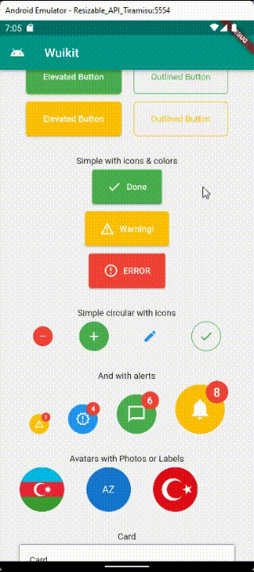

# wuikit

A new Flutter plugin project.

## About

This package is a collection of reusable widgets and components for Flutter.
This project is a starting point for a Flutter
[plug-in package](https://flutter.dev/developing-packages/),

## SimpleElevatedButton

Use case of the Simple Elevated Button:

    SimpleElevatedButton(
        child: const Text("Elevated Button"),
        color: Colors.blue,
        borderRadius: 8,
        padding: const EdgeInsets.all(8),
        onPressed: () {},
    ),

## SimpleOutlinedButton

Use case of the Simple Elevated Button:

    SimpleOutlinedButton(
        child: const Text("Elevated Button"),
        outlineColor: Colors.blue,
        textColor: Colors.white,
        borderRadius: 8,
        padding: const EdgeInsets.all(8),
        onPressed: () {},
    ),

## SimpleElevatedButtonWithIcon

Use case of the Simple Elevated Button With Icon:

    SimpleOutlinedButton(
        label: const Text("Done"),
        iconData: Icons.check,
        color: Colors.green,
        padding: const EdgeInsets.all(8),
        onPressed: () {},
    ),

## SimpleCircularIconButton

Use case of the Simple Circular Button With Icon:

        SimpleCircularIconButton(
            iconData: Icons.notifications,
            fillColor: Colors.amber,
            iconColor: Colors.white,
            outlineColor: Colors.blue,
            notificationFillColor: Colors.red,
            notificationCount: 8,
            radius: 80,
            onPressed: () {},
        ),

## Avatar

Use case of the Avatar. Use either label or imageUrl:

        Avatar(
            label: "AZ",
            imageUrl:URL,
            radius: 20,
            onPressed: () {},
            ),

## CardUI

Use case of the Card UI.

       CardUI(
            child: const Text("Card"),
            borderRadius: BorderRadius.circular(8),
            elevation: 15,
            backgroundColor: Colors.yellow,
            shadowColor: Colors.blue,
            shadowOffset: Offset(0, 8),
            shadowBlur: 8,
            padding: 40,
            height: 200,
            width: MediaQuery.of(context).size.width - 16,
            ),

## ExpandableSection

Use case of the Expandable Section.

    ExpandableSection(
        title: "Expandable section",
        child: const Text("Expandable section"),
        ),
